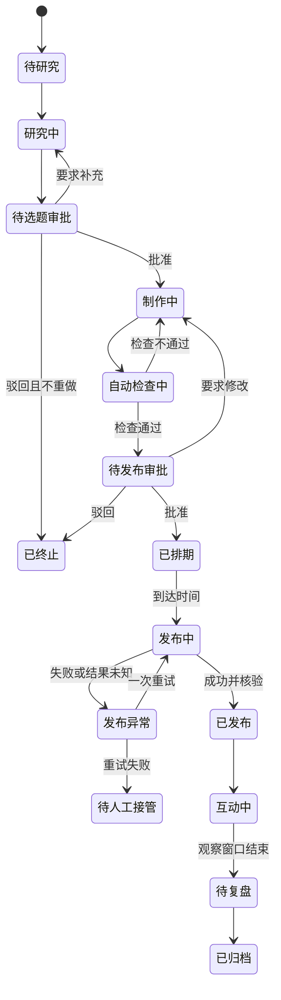

# AI 技术科普小红书自动运营系统：产品需求文档

## 1. 文档信息

| 项目 | 内容 |
|---|---|
| 版本 | 1.0 |
| 日期 | 2026-07-24 |
| 状态 | 产品基线 |
| 首发平台 | 小红书 |
| 控制入口 | 飞书机器人 |
| 首发内容形态 | 图文 |
| 运营规模 | 单账号、单运营者、每周五篇 |

## 2. 产品摘要

本产品是一套面向单人运营者的 AI 技术科普内容运营系统。系统自动完成跨平台研究、选题候选生成、图文制作、自动检查、排期、审批后发布、低风险评论回复、数据统计和归档；运营者通过飞书完成选题审批、发布审批、异常处理和策略确认。

产品第一阶段不销售明确产品，不以私信数量或成交额作为成功标准。核心任务是建立稳定内容闭环，验证目标用户、内容方向和真实问题。

## 3. 背景与问题

### 3.1 用户现状

运营者拥有服务器、本地 SQLite 数据库、OpenAI 大模型接口密钥、飞书机器人和小红书账号，但只有一人参与运营。

手工完成每周五篇高质量内容需要持续执行：

- 跨平台浏览和信息筛选；
- 事实核验；
- 选题比较；
- 标题、正文和图片制作；
- 发布排期；
- 评论检查与回复；
- 数据汇总；
- 经验归档。

这些工作包含大量重复操作，也包含不能交给自动化自由决定的高风险动作。

### 3.2 根本问题

1. 信息很多，但真正与目标用户相关且可信的信号很少。
2. 内容生产容易变成追热点和工具搬运，无法形成长期定位。
3. 单人运营难以稳定执行研究、制作、互动和复盘。
4. 自动发布和自动评论一旦对象错误、重复执行或表达失控，会直接伤害账号。
5. 如果没有实验设计和知识沉淀，系统只会重复生成内容，不会积累判断能力。

## 4. 产品目标与非目标

### 4.1 第一阶段产品目标

1. 支持单人稳定完成每周五篇图文内容。
2. 将人工工作集中在选题审批、发布审批、高风险异常和策略调整。
3. 每篇内容具备完整来源、生成、审核、审批、发布和复盘记录。
4. 发现目标用户反复出现的真实问题。
5. 形成可复用的内容结构、选题规则和失败经验。

### 4.2 长期业务目标

- 获得自然关注增长；
- 验证稳定内容方向；
- 建立目标用户问题地图；
- 为未来产品、服务或合作验证提供依据。

### 4.3 非目标

第一阶段不实现：

- 视频生成与发布；
- 多账号或多平台发布；
- 付费投流；
- 自动私信营销；
- 自动修改账号长期定位；
- 绕过人工审批的完全自治发布；
- 无限制自动评论；
- 复杂客户关系管理；
- 基于少量样本自动宣判内容策略有效或无效。

## 5. 目标用户与账号定位

### 5.1 产品直接用户

产品直接用户是唯一运营者，负责：

- 设置账号策略；
- 审批选题；
- 审批最终发布内容；
- 处理高风险评论和异常；
- 确认是否采纳策略调整。

### 5.2 内容目标用户

> 已经使用 ChatGPT、Codex 等 AI 工具，希望把 AI 接入真实工作，形成可重复运行的工作流，但缺少系统方法的人。

典型群体包括产品经理、运营人员、独立开发者和效率工具爱好者。

### 5.3 用户需求

- 理解智能体、工具调用、知识库和自动化的实际意义；
- 判断某项 AI 技术是否适合自己的工作；
- 用较低成本完成最小验证；
- 避开宣传中没有说明的失败条件；
- 看懂真实工作流，而不是只获得提示词或工具清单。

### 5.4 内容价值主张

> 把复杂的 AI 智能体与自动化技术，拆成看得懂、能判断、可以亲手验证的真实工作流。

### 5.5 账号人格

账号采用“AI 工作流实验员”人格：

- 懂技术但不卖弄；
- 亲自搭建、亲自验证；
- 先给结论，再解释原因；
- 区分事实、经验和推测；
- 展示失败、成本和适用边界；
- 不使用夸张导师、营销专家或资讯搬运号形象。

### 5.6 初始内容支柱

1. 概念拆解：解释技术是什么、为什么有用、边界在哪里。
2. 真实工作流实验：展示从问题、搭建到运行结果的完整过程。
3. 工具与方案判断：帮助用户理解方案取舍，不做简单排行榜。

## 6. 产品原则

1. **证据优先**：事实性内容必须保留来源和核验状态。
2. **人负责决策**：选题和发布必须由人审批。
3. **程序负责约束**：状态、权限、幂等、重试和频率限制由确定性程序控制。
4. **模型负责判断建议**：模型不得自行绕过状态机或执行高风险动作。
5. **可恢复**：任何步骤失败后都能从最近有效状态继续。
6. **可审计**：重要输入、输出、审批和外部动作均可追踪。
7. **最小权限**：每个连接器只获得完成任务所需的权限。
8. **先图文后视频**：图文闭环稳定后才扩展视频。
9. **一次只验证少量变量**：避免无法解释内容表现。
10. **不以自动化程度衡量成功**：自动化不能牺牲内容质量和账号安全。

## 7. 成功指标

### 7.1 系统指标

| 指标 | 最小版本目标 |
|---|---:|
| 每周计划发布数 | 5 |
| 计划内容完成率 | 不低于 80% |
| 重复有效发布 | 0 |
| 绕过审批发布 | 0 |
| 来源可追溯率 | 100% |
| 自动流程成功率 | 上线验收期不低于 80% |
| 单篇人工处理时间 | 稳定期目标不高于 15 分钟 |
| 高风险评论误自动回复 | 0 |

自动流程成功率指不需要修改代码或直接操作数据库即可完成或通过产品降级路径完成的任务比例。

### 7.2 内容指标

系统必须记录但不预设绝对达标值：

- 曝光或可获得的近似指标；
- 点赞数与点赞率；
- 收藏数与收藏率；
- 评论数与评论率；
- 新增关注及关注转化趋势；
- 有效问题数；
- 深度互动数；
- 不同内容支柱的相对表现；
- 不同标题、封面和正文结构的相对表现。

新账号前四周用于建立基线。不得用单篇表现直接修改账号定位。

### 7.3 用户问题发现指标

“有效问题”必须同时满足：

1. 来自目标用户或与目标场景高度一致；
2. 包含具体任务、限制、失败经历或判断困难；
3. 不是单纯索要资料、链接或提示词；
4. 可以归入已有问题簇或形成新问题簇。

系统记录：

- 每周有效问题数量；
- 重复问题簇数量；
- 每个问题簇涉及的独立用户数量；
- 用户愿意补充上下文或进一步交流的信号。

## 8. 角色与权限

### 8.1 运营者

拥有以下权限：

- 查看全部任务和资料；
- 修改账号策略；
- 批准、驳回或要求修改选题；
- 批准、驳回、延期或要求修改发布内容；
- 暂停或恢复自动化；
- 手动接管异常任务；
- 查看和导出数据；
- 修改评论自动回复策略。

### 8.2 系统执行身份

系统只能：

- 在策略许可范围内研究和生成；
- 创建待审批事项；
- 执行已有有效审批覆盖的发布动作；
- 在评论策略许可范围内发送单条回复；
- 采集并归档数据；
- 触发告警和降级。

系统不得：

- 自行批准选题或发布；
- 修改账号定位；
- 扩大连接器权限；
- 自动发送私信营销；
- 在审批内容变化后继续使用旧审批发布。

## 9. 核心领域对象

| 对象 | 说明 |
|---|---|
| 账号策略 | 目标用户、价值主张、人格、内容支柱、红线和自动化策略的版本化配置 |
| 研究信号 | 从外部来源采集的一条原始或标准化信息 |
| 证据包 | 支持某个选题或事实的来源集合及核验结论 |
| 选题候选 | 带用户问题、角度、证据、评分和风险的审批对象 |
| 内容任务 | 串联一次研究、制作、发布、互动和复盘的主对象 |
| 内容版本 | 标题、正文、图片、话题和来源说明的不可变版本 |
| 审批记录 | 审批对象、版本、结果、操作者、时间和意见 |
| 发布计划 | 计划时间、内容版本、审批凭证和平台目标 |
| 发布记录 | 平台结果、帖子标识、链接、时间和成功证据 |
| 评论事件 | 评论对象、内容、分类、风险和处理状态 |
| 回复记录 | 回复版本、对象校验、发送结果和证据 |
| 指标快照 | 某一观察时点的平台数据 |
| 实验 | 假设、变量、首要指标、观察窗口和结论 |
| 知识条目 | 可复用的选题、结构、风险、动作或复盘结论 |

## 10. 内容任务状态机

### 10.1 状态规则

1. 每次状态变化必须记录原因、时间和触发身份。
2. 只有合法状态转换可以执行。
3. 内容版本变化会使与旧版本绑定的发布审批失效。
4. 发布结果未知时，不得直接再次发布；必须先检查平台是否已生成帖子。
5. 已终止任务默认只读，恢复时创建新任务并关联原任务。

## 11. 核心使用流程

### 11.1 每周选题流程

1. 定时任务收集最近研究信号。
2. 系统完成标准化、去重、聚类和可信度判断。
3. 系统结合账号策略生成三至十个选题候选。
4. 飞书发送选题审批卡片。
5. 运营者批准、驳回或要求补充。
6. 系统为批准选题创建正式内容任务。
7. 每周保留五个主选题和最多两个替补选题。

### 11.2 内容制作与发布流程

1. 系统生成证据包、标题、正文、封面脚本和多页图片。
2. 系统执行事实、版权、风格、敏感信息和格式检查。
3. 检查失败时自动修改一次；仍失败则请求人工处理。
4. 检查通过后，飞书发送完整发布预览。
5. 运营者批准、驳回、延期或要求修改。
6. 批准后，系统创建与内容版本绑定的发布计划。
7. 到达计划时间后，系统进入发布页并再次校验账号、内容版本和审批。
8. 系统上传封面和图片，填写标题、正文及话题。
9. 三要素齐全且页面状态正确后执行发布。
10. 系统核验是否成功生成目标帖子并保存证据。

### 11.3 评论流程

1. 系统按配置周期检查新评论。
2. 系统确认评论所属账号、帖子、用户和内容。
3. 系统分类评论并计算风险等级。
4. 低风险评论生成回复并完成自动检查。
5. 发送前再次校验回复对象。
6. 每次只发送一条回复，确认成功后才处理下一条。
7. 中高风险评论发送飞书提醒，等待人工处理。
8. 评论中的有效问题进入用户问题库，并可成为下一轮研究信号。

### 11.4 复盘流程

1. 发布后按多个观察窗口采集指标。
2. 系统将结果与实验假设关联。
3. 系统输出支持、不支持或证据不足的结论。
4. 系统生成单篇复盘和每周对比复盘。
5. 可复用结论进入知识库，未经人工确认不得升级为长期策略。

## 12. 功能需求

### 12.1 账号策略

- `REQ-STR-001` 系统必须保存目标用户、价值主张、账号人格、内容支柱和禁区。
- `REQ-STR-002` 每次策略修改必须形成新版本并保留旧版本。
- `REQ-STR-003` 内容任务必须记录其使用的策略版本。
- `REQ-STR-004` 系统不得根据单篇或单周数据自动修改账号策略。
- `REQ-STR-005` 策略变更必须由运营者确认后生效。
- `REQ-STR-006` 系统必须支持全局暂停研究、发布和评论自动化，并可分别控制。

### 12.2 飞书任务入口

- `REQ-FEI-001` 运营者可以通过飞书创建临时研究或内容任务。
- `REQ-FEI-002` 系统必须通过飞书推送选题审批卡片。
- `REQ-FEI-003` 系统必须通过飞书推送发布审批卡片。
- `REQ-FEI-004` 审批卡片必须展示对象版本、关键内容、风险和有效操作。
- `REQ-FEI-005` 重复点击同一操作不得产生重复审批或重复任务。
- `REQ-FEI-006` 已过期或已处理卡片必须明确显示不可再次执行。
- `REQ-FEI-007` 系统必须支持查询任务当前状态和最近异常。
- `REQ-FEI-008` 系统必须把无法自动恢复的异常发送到飞书。

### 12.3 信息研究

- `REQ-RES-001` 最小版本必须接入谷歌、GitHub和小红书研究源。
- `REQ-RES-002` 研究信号必须记录来源地址、来源类型、作者或组织、发布时间和采集时间。
- `REQ-RES-003` 系统必须区分原始事实、来源观点和模型推断。
- `REQ-RES-004` 系统必须支持相同事件或内容的去重和聚类。
- `REQ-RES-005` 系统必须为来源标记可信度、新鲜度、相关性和版权风险。
- `REQ-RES-006` 技术能力、产品规格和时效性事实必须优先使用官方来源核验。
- `REQ-RES-007` 研究失败不得伪造缺失结果。
- `REQ-RES-008` 来源不可访问时必须保留失败状态和可用摘要，不得将二手摘要标记为已核验原文。
- `REQ-RES-009` 小红书研究必须排除本账号内容，避免自我强化。
- `REQ-RES-010` 系统必须限制研究频率并支持来源级暂停。

### 12.4 选题引擎

- `REQ-TOP-001` 每个选题候选必须包含用户问题、核心角度、发布理由、证据、风险和建议形式。
- `REQ-TOP-002` 选题评分必须至少考虑用户相关性、新鲜度、证据充分度、传播潜力、同质化和风险。
- `REQ-TOP-003` 分数必须附带可读解释，不得只输出总分。
- `REQ-TOP-004` 系统必须检测与近期已发布、已批准或待审批选题的重复程度。
- `REQ-TOP-005` 未获审批的选题不得进入正式内容制作。
- `REQ-TOP-006` 补充资料后必须形成新的候选版本。
- `REQ-TOP-007` 每个批准选题必须标注内容支柱、核心假设和首要指标。
- `REQ-TOP-008` 系统必须支持主选题和替补选题。

### 12.5 图文制作

- `REQ-CON-001` 系统必须生成至少两个标题候选。
- `REQ-CON-002` 标题必须符合平台当前长度限制；默认以不超过二十个汉字为优先目标。
- `REQ-CON-003` 正文必须包含结论、解释、限制条件和互动问题。
- `REQ-CON-004` 系统必须生成封面信息结构和多页配图脚本。
- `REQ-CON-005` 图片生成必须以已确认的视觉脚本为输入。
- `REQ-CON-006` 图片中的事实、数字和关键文字必须经过检查。
- `REQ-CON-007` 每个内容版本必须包含封面、标题、正文和话题建议。
- `REQ-CON-008` 系统必须保存生成输入、模型版本、输出版本和素材文件指针。
- `REQ-CON-009` 内容必须符合“AI 工作流实验员”人格。
- `REQ-CON-010` 内容不得虚构测试经历、数据或个人案例。
- `REQ-CON-011` 内容引用不得大段复制来源，不得复刻受版权保护的视觉素材。

### 12.6 自动检查

- `REQ-QA-001` 系统必须检查事实是否具有证据。
- `REQ-QA-002` 系统必须检查事实、观点和推测是否混淆。
- `REQ-QA-003` 系统必须检查来源是否过时或互相冲突。
- `REQ-QA-004` 系统必须检查标题、正文和图片表达是否一致。
- `REQ-QA-005` 系统必须检查隐私、密钥、内部路径和敏感信息泄漏。
- `REQ-QA-006` 系统必须检查夸大承诺、误导表达和不当营销。
- `REQ-QA-007` 系统必须检查版权和过度复刻风险。
- `REQ-QA-008` 所有检查结果必须包含规则、严重程度、证据位置和建议动作。
- `REQ-QA-009` 阻断级问题未解决时不得进入发布审批。
- `REQ-QA-010` 自动修订最多执行一次；再次失败必须转人工。

### 12.7 发布审批

- `REQ-APR-001` 发布审批必须展示最终封面、全部图片、标题、正文、话题、来源摘要和风险。
- `REQ-APR-002` 审批必须绑定不可变内容版本。
- `REQ-APR-003` 审批操作支持批准、驳回、延期和要求修改。
- `REQ-APR-004` 内容发生任何影响发布结果的变化后，旧审批必须失效。
- `REQ-APR-005` 审批记录必须包含操作者、时间、意见和版本。
- `REQ-APR-006` 默认审批有效期为二十四小时，并允许配置。

### 12.8 排期与发布

- `REQ-PUB-001` 系统必须支持按日期和时间排期。
- `REQ-PUB-002` 发布动作必须具有幂等键。
- `REQ-PUB-003` 发布前必须再次验证账号身份、内容版本、审批状态和计划时间。
- `REQ-PUB-004` 图文发布前必须确认封面、标题和正文齐全。
- `REQ-PUB-005` 上传完成后必须进入正确的图文编辑页。
- `REQ-PUB-006` 系统必须在执行最终发布前完成页面状态核验。
- `REQ-PUB-007` 发布后必须通过帖子标识、链接或平台页面状态确认结果。
- `REQ-PUB-008` 结果未知时必须先检查是否已经发布，不得直接重试。
- `REQ-PUB-009` 同一动作最多自动重试一次。
- `REQ-PUB-010` 第二次失败后必须停止并请求人工接管。
- `REQ-PUB-011` 发布记录必须保存计划时间、实际时间、平台结果和证据。
- `REQ-PUB-012` 系统必须支持全局紧急停止和单任务取消。

### 12.9 评论检查与回复

- `REQ-COM-001` 系统必须从通知或可验证入口获取新评论。
- `REQ-COM-002` 评论必须关联到准确的账号、帖子、用户和原文。
- `REQ-COM-003` 评论分类至少包括普通互动、追问、纠错、反对意见、潜在需求、垃圾信息和高风险内容。
- `REQ-COM-004` 系统必须为评论计算风险等级并说明原因。
- `REQ-COM-005` 只有低风险类别允许自动回复。
- `REQ-COM-006` 纠错、争议、投诉、敏感建议、外链诱导和身份不明确的评论必须升级人工。
- `REQ-COM-007` 回复不得虚构个人经历或承诺未来一定交付。
- `REQ-COM-008` 回复发送前必须两次校验回复对象。
- `REQ-COM-009` 每个发送动作只允许一条回复，确认成功后才能处理下一条。
- `REQ-COM-010` 连续回复默认间隔为八至十五秒。
- `REQ-COM-011` 系统必须配置每帖、每小时和每日自动回复上限。
- `REQ-COM-012` 平台出现频繁、过快、稍后再试或发送失败提示时必须立即停止自动回复。
- `REQ-COM-013` 单条回复建议不超过二百八十字。
- `REQ-COM-014` 每条自动回复必须保存生成版本、风险判断、对象校验和发送结果。
- `REQ-COM-015` 用户可以对某篇帖子或全局关闭自动回复。

默认最小版本限制：

- 每帖每小时最多三条自动回复；
- 全账号每日最多二十条自动回复；
- 相邻回复随机间隔八至十五秒；
- 一次评论轮询最多自动回复三条；
- 任一风控提示触发后，当日自动回复暂停，等待人工恢复。

以上数值是保守默认值，必须可配置。

### 12.10 用户问题库

- `REQ-INS-001` 系统必须从评论中识别候选有效问题。
- `REQ-INS-002` 有效问题必须保存场景、任务、限制和来源评论。
- `REQ-INS-003` 系统必须将相似问题聚类，同时保留独立用户数量。
- `REQ-INS-004` 系统不得因用户问题出现频率高就自动将其定义为商业需求。
- `REQ-INS-005` 高频问题可以进入下一轮选题候选。
- `REQ-INS-006` 涉及个人信息的内容在归档前必须脱敏。

### 12.11 数据统计与实验

- `REQ-ANA-001` 每篇内容必须关联一个实验假设。
- `REQ-ANA-002` 实验必须记录内容支柱、用户问题、标题结构、封面结构、正文结构、发布时间和首要指标。
- `REQ-ANA-003` 系统必须支持多个发布后观察窗口。
- `REQ-ANA-004` 所有指标快照必须保存采集时间和来源。
- `REQ-ANA-005` 系统必须区分原始指标、计算指标和模型解释。
- `REQ-ANA-006` 复盘结论只能为支持、不支持或证据不足。
- `REQ-ANA-007` 系统必须说明无法排除的影响因素。
- `REQ-ANA-008` 每周复盘必须比较内容支柱和实验变量。
- `REQ-ANA-009` 系统不得根据不足样本自动改变长期策略。
- `REQ-ANA-010` 运营者确认后，复盘结论才能升级为稳定知识条目。

默认观察窗口：

- 发布后二小时；
- 发布后二十四小时；
- 发布后七十二小时；
- 发布后七天。

若平台无法提供某项数据，系统必须标记为不可获得，不得推算成真实值。

### 12.12 归档与知识库

- `REQ-KNO-001` 系统必须归档内容、来源、审批、发布结果、评论、指标和复盘。
- `REQ-KNO-002` SQLite 是运行状态和结构化事实的权威存储。
- `REQ-KNO-003` 图片等二进制素材必须存入文件或对象存储，数据库只保存指针和校验值。
- `REQ-KNO-004` 飞书文档用于人类阅读的项目摘要、发布档案和周期复盘，不作为唯一状态源。
- `REQ-KNO-005` 知识条目至少分为账号、选题、模式、动作和复盘五类。
- `REQ-KNO-006` 每条知识必须包含结论、证据、可复用点、风险和下一步。
- `REQ-KNO-007` 知识状态必须支持实验中、生效和已废弃。
- `REQ-KNO-008` 已失效知识不得删除，必须标记为已废弃并保留原因。

### 12.13 运维控制

- `REQ-OPS-001` 系统必须提供健康状态，包括调度、数据库、模型、飞书和平台会话状态。
- `REQ-OPS-002` 系统必须支持查看失败任务及最近有效状态。
- `REQ-OPS-003` 系统必须支持从合法状态恢复任务。
- `REQ-OPS-004` 系统必须支持人工标记任务完成、取消或需要重做。
- `REQ-OPS-005` 系统必须提供研究、制作、发布和评论的独立开关。
- `REQ-OPS-006` 所有外部副作用必须进入审计日志。
- `REQ-OPS-007` 日志不得记录明文密钥、完整会话信息或未脱敏个人信息。

## 13. 审批模型

### 13.1 选题审批

审批对象是选题候选版本。批准表示允许系统围绕该用户问题、核心角度和证据范围制作内容，不表示允许发布。

### 13.2 发布审批

审批对象是不可变内容版本。批准只覆盖：

- 指定账号；
- 指定内容版本；
- 指定内容形态；
- 指定计划时间或允许时间窗口；
- 指定发布平台。

任何一项变化都需要重新审批。

### 13.3 审批幂等

- 每个审批操作具有唯一标识；
- 相同审批请求重复到达只处理一次；
- 已失效、已处理或版本不匹配的审批必须拒绝；
- 审批结果写入数据库成功后才向飞书返回成功。

## 14. 异常与降级

### 14.1 来源不可用

- 保存已获得结果；
- 标记缺失来源；
- 使用其他来源继续；
- 若关键事实无法核验，则阻断内容进入发布审批。

### 14.2 模型输出失败

- 对同一步骤自动重试一次；
- 第二次失败后保留输入、错误和最近有效产物；
- 转人工或等待下一次执行，不无限循环。

### 14.3 图片失败

- 保留已完成文本和视觉脚本；
- 允许重新生成单张图片；
- 图片文字检查未通过不得提交发布审批。

### 14.4 飞书不可用

- 不丢失待审批事项；
- 不把未送达视为已审批；
- 恢复后重新发送同一审批对象；
- 重复回调按幂等规则处理。

### 14.5 发布结果未知

- 立即停止再次点击发布；
- 通过账号主页、发布记录或页面状态检查是否已生成帖子；
- 确认未发布后才允许一次重试；
- 无法确认时转人工。

### 14.6 评论风控

- 出现频繁或过快提示后立即停止；
- 保存未处理评论队列；
- 飞书告警；
- 只有运营者明确恢复后才能继续自动回复。

## 15. 非功能需求

### 15.1 可靠性

- 数据库写入与外部副作用必须采用可恢复设计。
- 发布和回复必须防止重复执行。
- 服务重启后待执行任务不得丢失。
- 每个定时任务必须具有防重入机制。

### 15.2 安全

- 密钥通过环境变量或密钥服务注入，不进入数据库正文和飞书文档。
- 平台会话数据必须限制文件权限并与业务日志分离。
- 飞书回调必须校验来源和签名。
- 管理命令必须校验允许的飞书用户身份。
- 用户评论中的个人信息在知识归档前必须脱敏。

### 15.3 可观测性

每次运行至少记录：

- 任务和步骤标识；
- 开始和结束时间；
- 输入与输出摘要；
- 使用的策略、提示词和模型版本；
- 工具或连接器结果；
- 重试次数；
- 状态变化；
- 外部副作用；
- 错误类别和恢复建议。

### 15.4 性能

- 飞书普通查询命令应在三秒内返回已受理或当前状态。
- 审批操作应在五秒内给出处理结果。
- 长时间研究和生成任务使用异步状态，不要求同步等待。
- 最小版本只需支持单账号每周五篇，不为高并发提前复杂化。

### 15.5 可维护性

- 平台连接器与核心业务状态机分离。
- 提示词、策略和规则必须版本化。
- 每个领域模块具有明确输入、输出和错误类型。
- 数据库升级必须使用迁移脚本。

## 16. 外部依赖与约束

### 16.1 已有条件

- 一台可运行后台任务的服务器；
- SQLite；
- OpenAI 大模型接口；
- 飞书机器人；
- 小红书账号。

### 16.2 关键约束

- 小红书研究、发布、评论和数据获取可能依赖浏览器会话及页面结构。
- 页面变化、登录失效和平台风控属于正常异常，不得假设永远稳定。
- 谷歌、GitHub、小红书、X和抖音的数据权限与获取方式不同，必须分别适配。
- 第一版本不为未来多平台抽象所有细节，只保留清晰适配器边界。
- 视频功能必须在图文发布和复盘闭环达到稳定标准后启动。

## 17. 最小版本验收标准

最小版本只有同时满足以下条件才视为完成：

1. 可以通过飞书创建或触发一次选题研究。
2. 系统能从三个首批来源形成带证据的选题候选。
3. 未经选题批准，系统无法进入正式制作。
4. 批准后可生成完整图文版本并通过自动检查。
5. 飞书可展示完整发布预览并记录审批。
6. 修改内容后旧发布审批自动失效。
7. 审批后可按计划发布并保存成功证据。
8. 同一发布任务重复触发不会生成第二篇帖子。
9. 低风险评论可以在对象校验和频率限制下自动回复。
10. 高风险评论不会自动回复，并能通知运营者。
11. 可以采集多个观察窗口的数据并生成单篇复盘。
12. 可以生成周复盘并把确认后的结论写入知识库。
13. 服务重启后未完成任务仍能从合法状态恢复。
14. 日志、飞书文档和数据库中没有明文密钥。
15. 完成一次包含研究、双审批、制作、发布、互动、统计和归档的端到端演练。

## 18. 发布阶段

### 18.1 阶段零：人工验证

- 人工制作三至五篇内容；
- 验证目标用户、内容支柱和账号人格；
- 同时验证任务字段、审批卡片和复盘模板；
- 平台最终发布可以暂时人工完成。

### 18.2 阶段一：最小可行产品

- 飞书双审批；
- 三个研究源；
- 图文自动生成与检查；
- 审批后自动发布；
- 低风险评论自动回复；
- 指标采集和归档。

### 18.3 阶段二：稳定与学习

- 完善失败恢复和质量评分；
- 评论转选题；
- 内容实验比较；
- 策略版本管理；
- 接入 X 和抖音。

### 18.4 阶段三：视频与扩展

- 图文转视频脚本；
- 配音、字幕、剪辑和视频审核；
- 视频发布；
- 多平台适配；
- 在确有需求时增加多账号隔离。

## 19. 进入产品验证阶段的建议门槛

第一阶段满足以下大部分条件后，才讨论课程、工具、咨询或开发服务：

- 至少运行八周；
- 至少发布三十篇有效内容；
- 至少形成三个重复问题簇；
- 每个核心问题簇来自至少五位独立用户；
- 至少十位用户提供过具体场景或限制条件；
- 内容数据和评论证据表明问题持续存在；
- 运营者具备可验证的解决能力。

这些数值是决策辅助，不是机械门槛。最终进入产品验证仍由运营者决定。

## 20. 已确认决策

| 决策 | 结论 |
|---|---|
| 首发领域 | AI 技术科普 |
| 账号阶段 | 新账号 |
| 运营规模 | 一人、每周五篇 |
| 第一阶段目标 | 涨粉、内容验证、用户问题发现 |
| 第一阶段商业目标 | 暂不销售产品 |
| 第一目标用户 | 从对话式 AI 进阶到可运行工作流的人 |
| 账号人格 | AI 工作流实验员 |
| 内容支柱 | 概念拆解、真实工作流实验、工具与方案判断 |
| 自动化范围 | 研究、制图、排期、审批后发布、低风险评论回复、统计和归档 |
| 人工闸门 | 选题审批、发布审批 |
| 首发内容形态 | 图文 |
| 控制入口 | 飞书机器人 |
| 存储基础 | SQLite 加文件存储 |
| 首批研究源 | 谷歌、GitHub、小红书 |
| 后续研究源 | X、抖音 |
| 投流 | 第一阶段不考虑 |

## 21. 待技术设计回答的问题

以下问题不再作为产品决策阻塞项，交由技术顶层设计确定：

1. 工作流引擎采用何种实现方式。
2. 浏览器自动化与官方接口如何组合。
3. SQLite 的并发、备份和迁移策略。
4. 飞书机器人回调、审批卡片和文档归档如何分层。
5. 图片文件如何保存、校验和清理。
6. 模型调用如何结构化输出、重试和记录版本。
7. 发布与回复如何实现严格幂等。
8. 指标采集在平台能力受限时如何降级。
9. 不同模块应该实现为技能、确定性服务还是平台适配器。

