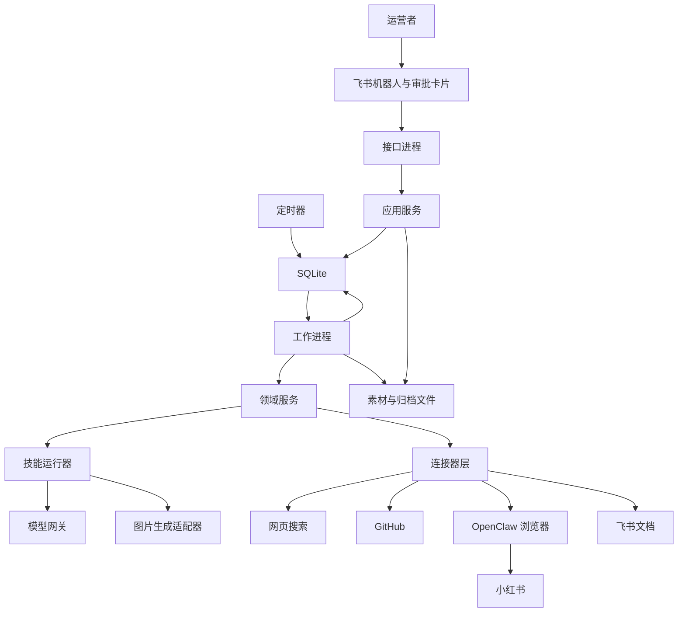

# AI 技术科普小红书自动运营系统：技术顶层设计

## 1. 文档信息

| 项目 | 内容 |
|---|---|
| 版本 | 1.0 |
| 日期 | 2026-07-24 |
| 状态 | 技术基线 |
| 对应产品需求 | `docs/02-prd.md` |
| 部署规模 | 单服务器、单账号、单运营者 |

## 2. 设计结论

最小版本采用“模块化单体＋独立执行进程”，不采用微服务，也不引入大型分布式工作流平台。

核心形态：

```text
飞书与定时器
      ↓
接口进程
      ↓
SQLite 状态机与任务队列
      ↓
单工作进程
      ↓
模型、图片、研究源、OpenClaw 浏览器、飞书文档
```

这个选择与当前规模匹配：

- 单账号；
- 单运营者；
- 每周五篇；
- 已有单台服务器和 SQLite；
- 主要复杂度来自流程可靠性和平台不稳定，而不是高并发。

系统从第一天保留清晰模块边界和适配器接口，但不提前承担服务发现、消息中间件、分布式事务和跨服务追踪成本。

## 3. 技术目标

### 3.1 必须实现

1. 双审批不可绕过。
2. 发布和回复严格防重。
3. 所有长任务异步执行并可恢复。
4. 外部平台失败不会破坏内部状态。
5. 模型输出经过结构校验后才能进入下一步。
6. 技能、业务规则和平台操作相互隔离。
7. SQLite 保持可备份、可迁移、可替换。
8. 平台连接器可以独立降级和熔断。

### 3.2 暂不优化

- 多服务器水平扩展；
- 每秒大量请求；
- 多租户隔离；
- 多区域容灾；
- 通用无代码流程编辑器；
- 任意组合的多智能体协作。

## 4. 核心架构原则

### 4.1 领域逻辑不依赖平台页面

内容任务、审批、发布计划和评论策略属于核心领域。小红书页面结构、飞书卡片格式和模型接口属于外部适配器。核心领域不得直接调用浏览器或外部接口。

### 4.2 外部副作用必须晚于状态确认

发送卡片、发布帖子、回复评论和写飞书文档都属于外部副作用。执行前必须先创建可追踪动作记录，执行后再保存结果，避免服务崩溃造成“外部成功、内部未知”。

### 4.3 模型没有写权限

模型只返回结构化建议。模型不能直接：

- 修改任务状态；
- 写业务表；
- 发送飞书消息；
- 点击发布；
- 回复评论；
- 改变频率限制；
- 读取密钥。

### 4.4 技能与工作流分离

技能负责认知任务：

- 研究摘要；
- 选题生成；
- 内容生成；
- 内容检查；
- 评论分类和回复建议；
- 数据复盘。

工作流负责确定性任务：

- 选择下一步骤；
- 校验状态；
- 校验审批；
- 保存版本；
- 调度与重试；
- 执行连接器；
- 记录审计。

### 4.5 所有版本均不可隐式覆盖

账号策略、提示词、选题、内容、审批和回复均使用版本标识。新版本作为新记录保存，旧版本只读。这样可以准确回答“当时为什么发布了这篇内容”。

## 5. 总体架构



## 6. 部署拓扑

### 6.1 最小部署单元

单台服务器运行四个逻辑进程：

1. **接口进程**
   - 接收飞书事件和审批回调；
   - 提供内部健康检查和管理接口；
   - 只执行短事务；
   - 不同步执行研究、制图或浏览器任务。

2. **工作进程**
   - 从数据库领取任务；
   - 执行工作流步骤；
   - 每次只执行有限数量的外部副作用；
   - 最小版本保持单实例，降低 SQLite 写竞争和浏览器会话冲突。

3. **调度进程**
   - 创建研究、发布、评论检查和指标采集任务；
   - 不直接调用外部平台；
   - 使用数据库锁防止重复调度。

4. **OpenClaw 浏览器运行环境**
   - 固定使用隔离的 `openclaw` 配置；
   - 保存小红书登录状态；
   - 与日常浏览器隔离；
   - 只通过浏览器网关适配器调用。

### 6.2 推荐运行方式

初期可以用单台服务器上的容器编排或进程管理器运行。接口、工作进程和调度进程使用同一代码镜像、不同启动命令。

不建议第一阶段上 Kubernetes。当前问题规模不需要集群编排，且浏览器有状态会增加部署复杂度。

### 6.3 单工作进程的原因

SQLite 在写入时仍存在单写者约束。最小版本采用单工作进程、短事务和写前日志模式，可以满足当前吞吐。接口进程仅处理短写入，避免多个长事务竞争。

当出现以下任一情况时再评估 PostgreSQL 和多工作进程：

- 多账号；
- 每日数十篇以上内容；
- 评论量显著增长；
- 数据库锁等待持续出现；
- 工作队列积压影响发布时间；
- 需要多服务器容灾。

## 7. 建议技术栈

### 7.1 后端

- 语言：Python；
- 接口框架：FastAPI；
- 数据访问：SQLAlchemy；
- 数据库迁移：Alembic；
- 数据校验：基于类型模型和结构定义；
- 接口服务：异步服务器；
- 测试：单元测试、集成测试和浏览器契约测试；
- 部署：容器或系统服务。

选择 Python 是因为模型调用、数据处理、图片生成和浏览器自动化生态集中，且当前吞吐不要求更复杂的并发模型。

### 7.2 数据库

- SQLite 文件数据库；
- 启用外键约束；
- 使用写前日志模式；
- 设置合理忙等待时间；
- 所有写事务保持短小；
- 使用数据库迁移管理结构；
- 每日在线备份并定期验证恢复。

不得直接复制正在写入的单个数据库主文件作为唯一备份方式。备份必须使用 SQLite 支持的一致性备份方式，并包含恢复演练。

### 7.3 浏览器执行

小红书浏览、研究、发布和评论统一通过 OpenClaw 浏览器适配器执行：

- 固定指定 `profile="openclaw"`；
- 动作前检查会话和目标标签页；
- 优先结构化页面求值，关键节点才保存快照；
- 每个动作最多重试一次；
- 连续失败后切换稳健路径或人工接管；
- 登录由运营者在隔离配置中手动完成；
- 不把账号密码交给模型或自动登录流程。

### 7.4 模型与图片

模型能力通过统一网关调用：

- 文本模型；
- 可选视觉检查模型；
- 图片生成模型；
- 可替换的后备模型。

业务模块不得直接依赖特定模型名称。模型配置由能力名称解析，例如：

- `research_summarizer`
- `topic_planner`
- `content_writer`
- `content_reviewer`
- `comment_classifier`
- `reply_writer`
- `review_analyst`
- `image_generator`

## 8. 代码模块

建议目录：

```text
src/
  api/
    feishu_webhook.py
    approvals.py
    admin.py
    health.py
  application/
    commands/
    queries/
    workflows/
    handlers/
  domain/
    strategy/
    research/
    topics/
    content/
    approvals/
    publishing/
    comments/
    analytics/
    knowledge/
    operations/
  skills/
    research_synthesis/
    topic_planning/
    content_writing/
    content_review/
    comment_triage/
    reply_writing/
    performance_review/
  adapters/
    database/
    feishu/
    search/
    github/
    openclaw/
    llm/
    image/
    files/
    clock/
  worker/
    runner.py
    leases.py
    retries.py
  scheduler/
    jobs.py
    runner.py
  migrations/
  settings/
tests/
  unit/
  integration/
  contract/
  end_to_end/
```

### 8.1 领域层

只包含业务概念和规则，不访问网络、文件或数据库。典型对象：

- `ContentTask`
- `TopicProposal`
- `ContentVersion`
- `Approval`
- `PublicationPlan`
- `CommentEvent`
- `ReplyDecision`
- `Experiment`

### 8.2 应用层

编排一个用例，负责：

- 读取领域对象；
- 调用领域规则；
- 创建待执行动作；
- 提交事务；
- 不包含平台页面细节。

### 8.3 技能层

每个技能是一个受版本控制的认知组件，至少包含：

- 任务说明；
- 输入结构；
- 输出结构；
- 提示词模板；
- 示例；
- 禁止行为；
- 质量检查；
- 版本号。

技能不直接写数据库或操作平台。

### 8.4 适配器层

封装所有外部依赖：

- 飞书事件、卡片和文档；
- 网页搜索；
- GitHub；
- OpenClaw；
- 模型；
- 图片生成；
- 文件系统；
- 数据库；
- 时间。

## 9. 工作流执行模型

### 9.1 不引入大型工作流平台

最小版本使用数据库驱动的持久任务队列：

```text
创建工作项
→ 工作进程领取租约
→ 校验前置状态
→ 执行一个步骤
→ 原子保存结果和下一工作项
→ 完成或进入等待
```

每个工作项只完成一个明确步骤。人工审批不是工作进程阻塞等待，而是任务进入等待状态，由飞书回调创建后续工作项。

### 9.2 工作项字段

建议包含：

- `id`
- `workflow_id`
- `task_id`
- `step_type`
- `status`
- `attempt`
- `max_attempts`
- `available_at`
- `lease_owner`
- `lease_expires_at`
- `idempotency_key`
- `input_ref`
- `output_ref`
- `error_code`
- `error_detail`
- `created_at`
- `updated_at`

### 9.3 租约规则

- 工作进程通过短事务领取工作项；
- 租约具有过期时间；
- 工作进程定期续约长任务；
- 进程崩溃后，过期工作项可重新领取；
- 外部副作用必须另外使用幂等记录，不能只依赖工作项租约。

### 9.4 重试规则

错误分为：

1. **可重试**
   - 临时网络错误；
   - 模型暂时不可用；
   - 页面元素短暂失效。

2. **需要补充输入**
   - 关键来源不足；
   - 图片资料缺失；
   - 审批意见要求修改。

3. **需要人工**
   - 登录失效；
   - 平台风控；
   - 发布结果无法确认；
   - 高风险评论；
   - 连续两次动作失败。

4. **永久失败**
   - 非法状态转换；
   - 审批已失效；
   - 内容版本不存在；
   - 权限不足。

默认自动重试一次。重试必须使用相同业务幂等键，并记录首次失败。

## 10. 事务、发件箱与幂等

### 10.1 事务发件箱

内部状态变更和“需要执行外部动作”的记录在同一个数据库事务中提交。

示例：

```text
批准发布
→ 同一事务写入审批记录、任务状态、发布工作项
→ 事务成功
→ 工作进程稍后执行平台发布
```

这样不会出现“审批已记录但发布任务丢失”。

### 10.2 外部动作记录

所有外部副作用先创建 `external_actions` 记录：

- 动作类型；
- 业务对象；
- 幂等键；
- 请求摘要；
- 状态；
- 尝试次数；
- 外部结果；
- 成功证据；
- 创建和完成时间。

### 10.3 发布幂等

发布幂等键建议由以下字段组成：

```text
平台 + 账号 + 内容任务 + 内容版本 + 发布计划
```

执行发布前：

1. 查找是否已有成功动作；
2. 查找是否有结果未知动作；
3. 核验平台是否已存在对应帖子；
4. 只有明确未发布才允许执行。

### 10.4 评论回复幂等

回复幂等键建议由以下字段组成：

```text
平台 + 账号 + 帖子 + 原评论 + 回复版本
```

同一评论的同一回复版本只能成功发送一次。若需要改写回复，必须生成新版本并重新通过风险检查。

### 10.5 飞书回调幂等

飞书事件标识和卡片操作标识分别建立唯一约束。只有数据库事务成功后才返回成功状态。

## 11. 数据架构

### 11.1 主要表

#### 策略与配置

- `accounts`
- `account_strategy_versions`
- `automation_policies`
- `model_capability_configs`
- `prompt_versions`

#### 研究与选题

- `research_runs`
- `research_sources`
- `research_signals`
- `signal_clusters`
- `evidence_packages`
- `evidence_items`
- `topic_proposals`
- `topic_proposal_versions`

#### 内容与审批

- `content_tasks`
- `content_versions`
- `content_assets`
- `quality_checks`
- `approval_requests`
- `approval_decisions`

#### 发布与互动

- `publication_plans`
- `publication_records`
- `comment_events`
- `comment_classifications`
- `reply_versions`
- `reply_records`
- `rate_limit_buckets`

#### 数据与知识

- `metric_snapshots`
- `experiments`
- `experiment_observations`
- `problem_candidates`
- `problem_clusters`
- `knowledge_entries`
- `archive_records`

#### 运行与审计

- `workflow_instances`
- `work_items`
- `external_actions`
- `inbox_events`
- `audit_logs`
- `system_pauses`
- `connector_health`

### 11.2 标识策略

- 内部对象使用不可推测的全局唯一标识；
- 平台标识作为独立字段保存；
- 不把平台链接作为主键；
- 所有表保存创建时间和更新时间；
- 版本表只追加，不原地覆盖正文。

### 11.3 时间

- 数据库存储统一使用协调世界时；
- 展示和排期使用运营者配置时区；
- 每个发布计划保存原始时区；
- 夏令时变化必须通过时区数据库处理，不使用固定时差。

### 11.4 文件存储

目录建议：

```text
data/
  assets/
    content/<任务标识>/<版本标识>/
  snapshots/
    browser/<日期>/
  archives/
    weekly/<年份>/<周次>/
  exports/
  backups/
```

每个文件记录：

- 内容类型；
- 字节数；
- 校验值；
- 创建时间；
- 来源；
- 所属任务和版本；
- 保留策略。

不得仅靠文件名判断内容归属。

## 12. 模型网关与技能协议

### 12.1 统一调用请求

模型调用请求至少包含：

- 能力名称；
- 技能名称和版本；
- 提示词版本；
- 输入结构版本；
- 输出结构版本；
- 任务标识；
- 超时；
- 最大重试次数；
- 是否允许视觉输入；
- 数据敏感级别。

### 12.2 统一调用结果

保存：

- 供应方；
- 实际模型；
- 请求时间；
- 输出结构；
- 用量；
- 延迟；
- 停止原因；
- 结构校验结果；
- 重试记录；
- 安全过滤结果。

### 12.3 结构校验

所有技能输出必须通过结构定义校验。失败处理顺序：

1. 使用原响应进行一次结构修复；
2. 仍失败则重新调用一次；
3. 再失败转人工或终止步骤。

结构修复不得补造缺失事实。

### 12.4 提示词注入防护

外部网页、评论和仓库文本全部视为不可信数据：

- 明确标记数据边界；
- 不允许来源文本改变系统指令；
- 不允许来源请求工具调用；
- 不把来源中的密钥请求传递给执行层；
- 模型输出的链接和命令不自动执行；
- 进入内容前执行事实和安全检查。

## 13. 连接器设计

### 13.1 统一连接器协议

每个连接器实现：

- 健康检查；
- 能力声明；
- 请求执行；
- 规范化结果；
- 错误分类；
- 限速状态；
- 可选幂等支持；
- 脱敏日志。

连接器错误不得直接泄露为业务状态，由应用层映射。

### 13.2 网页搜索连接器

职责：

- 执行查询；
- 返回标题、摘要、地址和时间信息；
- 获取可访问原文；
- 标记搜索摘要与原文的区别。

不负责判断事实真假，核验由研究技能和证据服务完成。

### 13.3 GitHub 连接器

优先使用官方接口获取：

- 仓库元数据；
- 发布信息；
- 问题和讨论；
- 必要的文件内容。

必须保存仓库、提交或发布版本指针，避免后续内容变化导致证据不可复现。

### 13.4 小红书连接器

通过 OpenClaw 浏览器适配器提供：

- 搜索和内容研究；
- 发布页准备；
- 图文上传；
- 发布执行；
- 评论检查；
- 评论回复；
- 指标采集；
- 关键状态证据。

连接器内部维护页面定位策略，但对应用层只暴露领域动作。

### 13.5 飞书连接器

拆成三个能力：

1. 事件入口；
2. 审批卡片与通知；
3. 文档归档。

卡片操作仅提交命令，不直接执行长任务。文档写入失败不阻塞已完成的发布，但必须进入待补归档队列。

## 14. 小红书浏览器执行策略

### 14.1 会话管理

- 使用独立 `openclaw` 配置；
- 手动登录；
- 每次执行前健康检查；
- 明确选择账号和标签页；
- 登录失效后暂停发布与回复，只允许通知人工。

### 14.2 页面动作

- 优先使用页面结构求值；
- 只在登录确认、编辑完成、发布前和发布后保存关键快照；
- 页面引用失效时刷新快照后重试一次；
- 连续失败后不盲目点击；
- 上传文件先进入浏览器允许目录；
- 搜索研究只能从搜索结果进入帖子并校验内容。

### 14.3 发布

发布分成两个技术步骤：

1. **准备发布页**
   - 上传全部图片；
   - 填写标题、正文和话题；
   - 验证三要素；
   - 保存发布前证据。

2. **提交并核验**
   - 再次校验审批和版本；
   - 点击发布；
   - 查找成功提示或新帖子；
   - 保存平台标识和证据。

准备发布页与提交发布可以属于同一工作项，但必须在最终点击前重新读取数据库状态，以便紧急暂停能够生效。

### 14.4 评论

- 优先通知页；
- 点击回复后校验目标用户名；
- 输入后再次校验；
- 明确点击发送，不依赖回车；
- 每次只发送一条；
- 成功后确认输入框清空或回复可见；
- 频繁、过快或失败提示触发评论熔断。

## 15. 飞书交互设计

### 15.1 命令

最小命令：

- 创建研究任务；
- 查看本周选题；
- 查看任务状态；
- 暂停或恢复研究；
- 暂停或恢复发布；
- 暂停或恢复评论；
- 查看异常；
- 查看周报。

### 15.2 选题审批卡片

展示：

- 用户问题；
- 核心结论；
- 推荐理由；
- 关键证据；
- 内容支柱；
- 实验假设；
- 风险；
- 评分与解释。

操作：

- 批准；
- 驳回；
- 补充研究；
- 修改意见。

### 15.3 发布审批卡片

展示：

- 内容版本；
- 封面和全部配图；
- 标题和正文；
- 来源摘要；
- 自动检查结果；
- 计划时间；
- 风险。

操作：

- 批准；
- 驳回；
- 要求修改；
- 延期。

### 15.4 异常卡片

展示：

- 当前任务；
- 失败步骤；
- 已完成工作；
- 错误类别；
- 是否发生外部副作用；
- 系统已经尝试的恢复；
- 推荐的单一人工动作。

## 16. 调度设计

### 16.1 任务类型

- 每周研究；
- 临时研究；
- 内容制作；
- 发布；
- 评论轮询；
- 指标采集；
- 单篇复盘；
- 周复盘；
- 归档补偿；
- 数据库备份；
- 健康检查。

### 16.2 调度防重

每个周期任务使用：

```text
任务类型 + 账号 + 计划窗口
```

作为唯一业务键。同一窗口重复启动只产生一个任务。

### 16.3 时间策略

- 发布以运营者时区排期；
- 调度进程使用协调世界时计算执行；
- 错过发布时间时不立即补发，进入规则判断：
  - 延迟在允许窗口内则继续；
  - 超出窗口则请求重新排期；
  - 不在未知时间自动补发。

## 17. 频率限制与熔断

### 17.1 限制维度

- 连接器；
- 账号；
- 动作类型；
- 帖子；
- 小时；
- 自然日。

### 17.2 评论默认值

- 每帖每小时最多三条；
- 每日最多二十条；
- 相邻发送间隔八至十五秒；
- 单轮最多三条；
- 风控提示后暂停到人工恢复。

### 17.3 熔断器

每个连接器维护：

- 连续失败次数；
- 最近失败时间；
- 熔断状态；
- 再试时间；
- 人工恢复要求。

发布和评论不允许仅按固定时间自动解除高风险熔断。

## 18. 安全设计

### 18.1 密钥

- 模型密钥和飞书凭证由环境变量或外部密钥管理提供；
- 进程只读取必要密钥；
- 日志统一脱敏；
- 密钥不写入提示词、数据库业务字段或归档文档；
- 定期轮换。

### 18.2 飞书身份

- 验证回调签名；
- 仅允许配置的用户执行审批和管理命令；
- 所有审批保存飞书用户标识；
- 机器人群聊中忽略未授权操作。

### 18.3 浏览器

- 独立配置与日常浏览器隔离；
- 浏览器网关只监听本机或受控私网；
- 远程调试地址和令牌视为密钥；
- 不向公网直接暴露浏览器控制接口；
- 截图和页面快照按敏感数据处理。

### 18.4 内容

- 外部文本视为不可信；
- 评论进入模型前做长度限制和控制字符清理；
- 归档前移除个人联系方式和不必要身份信息；
- 内容生成不得使用密钥、内部路径和系统提示词。

## 19. 可观测性

### 19.1 日志

结构化日志字段：

- 时间；
- 级别；
- 任务；
- 工作流；
- 步骤；
- 连接器；
- 尝试次数；
- 错误代码；
- 耗时；
- 外部动作标识；
- 追踪标识。

不记录完整评论私密信息、密钥和浏览器会话。

### 19.2 指标

系统指标：

- 工作项积压；
- 工作项执行时长；
- 各步骤成功率；
- 重试率；
- 数据库锁等待；
- 模型调用次数、耗时和用量；
- 浏览器动作失败率；
- 发布成功率；
- 评论熔断次数；
- 飞书卡片送达和回调成功率。

### 19.3 告警

必须告警：

- 发布结果未知；
- 绕过审批尝试；
- 登录失效；
- 评论风控；
- 数据库备份失败；
- 工作队列长时间停滞；
- 飞书回调持续失败；
- 检测到疑似密钥泄漏。

## 20. 备份与恢复

### 20.1 备份内容

- SQLite 一致性备份；
- 账号策略和提示词版本；
- 内容素材；
- 浏览器关键证据；
- 人类可读归档；
- 配置清单，不含明文密钥。

### 20.2 备份周期

- 数据库每日备份；
- 发布后可触发增量或额外备份；
- 保留多个时间点；
- 每月至少一次恢复演练。

### 20.3 恢复目标

恢复后必须能够判断：

- 哪些任务已完成；
- 哪些任务待执行；
- 哪些外部动作已成功；
- 哪些动作结果未知；
- 哪些审批仍有效。

恢复后禁止立即重新执行结果未知的发布或回复动作。

## 21. 测试策略

### 21.1 单元测试

覆盖：

- 状态转换；
- 审批有效性；
- 内容版本失效；
- 风险规则；
- 频率限制；
- 幂等键；
- 实验计算；
- 隐私脱敏。

### 21.2 集成测试

覆盖：

- SQLite 事务与迁移；
- 工作项租约；
- 发件箱；
- 飞书事件幂等；
- 模型结构校验；
- 文件校验与归档；
- 连接器错误映射。

### 21.3 契约测试

每个外部适配器保存经过脱敏的输入输出样例，验证：

- 飞书事件结构；
- 飞书卡片回调；
- GitHub 返回结构；
- 搜索结果结构；
- OpenClaw 浏览器结果；
- 模型结构化输出。

### 21.4 浏览器演练

发布和评论测试分级：

1. 静态页面或测试替身；
2. 真实页面只准备到发布按钮前；
3. 运营者批准的真实小范围发布；
4. 发布后核验和恢复演练。

不得在自动测试中无审批执行真实发布或评论。

### 21.5 故障注入

至少演练：

- 数据库提交前进程崩溃；
- 外部发布成功但响应丢失；
- 飞书重复回调；
- 模型返回非法结构；
- 图片只生成部分文件；
- 登录过期；
- 评论对象发生漂移；
- 服务重启后租约过期；
- 备份恢复后的结果未知任务。

## 22. 开发阶段

### 阶段一：领域骨架

- 项目骨架；
- 配置与密钥；
- 数据库迁移；
- 领域对象；
- 状态机；
- 工作项与租约；
- 审计日志；
- 测试基础。

### 阶段二：飞书与审批

- 事件入口；
- 用户鉴权；
- 选题审批；
- 发布审批；
- 卡片幂等；
- 暂停和恢复。

### 阶段三：研究与选题

- 网页搜索；
- GitHub；
- 小红书研究；
- 研究技能；
- 证据包；
- 选题技能；
- 去重和评分。

### 阶段四：内容与图片

- 文本生成；
- 视觉脚本；
- 图片生成；
- 自动检查；
- 内容版本；
- 发布预览。

### 阶段五：发布

- OpenClaw 健康检查；
- 发布页准备；
- 最终发布；
- 幂等和结果核验；
- 异常接管。

### 阶段六：评论

- 评论采集；
- 分类和风险；
- 回复生成；
- 频率限制；
- 自动发送；
- 熔断与人工升级。

### 阶段七：数据和知识

- 指标采集；
- 实验关联；
- 单篇和周复盘；
- 问题聚类；
- 飞书文档归档；
- 知识条目生命周期。

### 阶段八：端到端验收

- 真实流程演练；
- 故障恢复；
- 安全检查；
- 备份恢复；
- 连续两周影子运行；
- 再开启审批后自动发布。

## 23. 关键技术决策记录

### 决策一：模块化单体

**结论**：采用。

**原因**：当前吞吐低，复杂度集中在领域状态和外部平台。模块化单体更容易保证事务、调试和部署。

### 决策二：SQLite 作为第一阶段数据库

**结论**：采用。

**条件**：单工作进程、短事务、写前日志、备份和迁移必须落实。

### 决策三：数据库驱动持久队列

**结论**：采用。

**原因**：避免引入消息中间件，同时满足服务重启恢复和人工等待。

### 决策四：不使用通用多智能体框架

**结论**：第一阶段不采用。

**原因**：系统需要明确、可审计的步骤，而不是智能体自由协商。多个认知任务通过独立技能实现。

### 决策五：OpenClaw 作为小红书浏览器执行面

**结论**：采用。

**原因**：需要隔离登录配置、稳定标签页控制、页面快照和人工接管能力。

### 决策六：飞书是控制面，不是权威状态源

**结论**：采用。

**原因**：卡片可能重复、过期或送达失败，业务状态必须由数据库决定。

### 决策七：图片使用文件存储

**结论**：采用。

**原因**：SQLite 不适合承载大量图片二进制；数据库保存元数据和校验值即可。

## 24. 升级路径

当单机架构达到边界时，按以下顺序升级：

1. 先优化慢任务、索引和事务；
2. 将图片迁移到对象存储；
3. 将 SQLite 迁移到 PostgreSQL；
4. 再增加多个工作进程；
5. 只有出现跨服务独立扩缩容需求时才拆服务；
6. 只有工作流规模和恢复复杂度显著增长时才引入专用工作流平台。

不得以“未来可能增长”为理由提前执行全部升级。

## 25. 产品需求映射

| 产品需求领域 | 技术模块 |
|---|---|
| 账号策略 | `domain/strategy`、策略版本表 |
| 飞书入口 | `api/feishu_webhook`、`adapters/feishu` |
| 信息研究 | `domain/research`、研究技能、来源连接器 |
| 选题 | `domain/topics`、选题技能 |
| 图文制作 | `domain/content`、内容与图片技能 |
| 自动检查 | 内容检查技能、质量检查表 |
| 双审批 | `domain/approvals`、飞书卡片、版本校验 |
| 排期发布 | `domain/publishing`、调度器、OpenClaw |
| 评论 | `domain/comments`、评论技能、限流与熔断 |
| 数据实验 | `domain/analytics`、指标快照 |
| 用户问题库 | `domain/knowledge`、问题聚类 |
| 归档 | 文件适配器、飞书文档适配器 |
| 运维 | 工作项、外部动作、审计、健康与告警 |

## 26. 参考依据

技术选型与关键约束参考以下官方资料：

- FastAPI 的部署关注点包括安全、启动、重启和进程复制：[部署说明](https://fastapi.tiangolo.com/deployment/)
- SQLAlchemy 官方文档说明 SQLite 事务控制和并发使用存在需要显式处理的行为：[SQLite 方言](https://docs.sqlalchemy.org/en/20/dialects/sqlite.html)
- SQLite 写前日志模式允许读写并发，但仍需控制写事务和检查点：[写前日志](https://www.sqlite.org/wal.html)
- OpenClaw 提供隔离浏览器配置、标签页控制、快照和远程控制边界：[浏览器说明](https://docs.openclaw.ai/browser)
- OpenClaw 建议需要登录的平台由用户在独立浏览器配置中手动登录，不向模型提供密码：[浏览器登录](https://docs.openclaw.ai/tools/browser-login)

